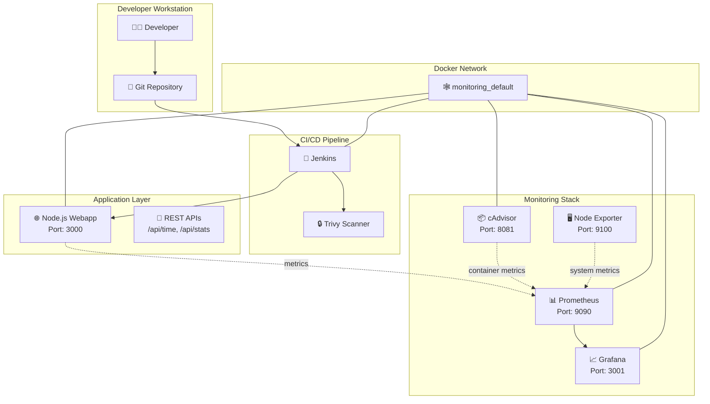

# 🚀 DevSecOps Project: Complete CI/CD Pipeline with Monitoring & Security

A comprehensive DevSecOps implementation featuring a dynamic Node.js webapp with complete CI/CD pipeline, security scanning, monitoring, and visualization.


## 📋 Table of Contents

- [🎯 Project Overview](#-project-overview)
- [🏗️ Architecture](#️-architecture)
- [📁 Project Structure](#-project-structure)
- [🛠️ Technology Stack](#️-technology-stack)
- [⚡ Quick Start](#-quick-start)
- [🔧 Detailed Setup](#-detailed-setup)
- [📊 Monitoring & Dashboards](#-monitoring--dashboards)
- [🔒 Security Scanning](#-security-scanning)
- [🔄 CI/CD Pipeline](#-cicd-pipeline)
- [🌐 Access URLs](#-access-urls)
- [📈 Features](#-features)
- [🧪 Testing](#-testing)
- [🔍 Troubleshooting](#-troubleshooting)
- [📚 Documentation](#-documentation)

## 🎯 Project Overview

This project demonstrates a complete DevSecOps implementation with:

- **Dynamic Web Application**: Real-time Node.js webapp with REST APIs
- **Containerization**: Docker containers for all services
- **CI/CD Pipeline**: Jenkins automation with security scanning
- **Security**: Trivy vulnerability scanning
- **Monitoring**: Prometheus metrics collection
- **Visualization**: Grafana dashboards with real-time data
- **Infrastructure**: Complete Docker Compose setup

### Key Benefits

✅ **Production-Ready**: Complete setup with health checks and monitoring  
✅ **Security-First**: Automated vulnerability scanning in CI/CD  
✅ **Observable**: Full monitoring with metrics, logs, and dashboards  
✅ **Scalable**: Containerized architecture with proper networking  
✅ **Automated**: Complete CI/CD pipeline with testing and deployment  

## 🏗️ Architecture



## 📁 Project Structure

```
devsecops-project/
├── 📄 README.md                              # This file
├── 🔄 restart_deployment.sh                  # Complete restart script
├── 🕸️ fix_networks.sh                        # Network troubleshooting
├── 🚦 traffic_test.sh                        # Traffic generation & testing
├── 🐳 docker-compose.yml                     # Main webapp compose
│
├── 📱 webapp/                                 # Node.js Application
│   ├── 📦 package.json                       # Dependencies
│   ├── 🚀 app.js                            # Main application
│   ├── 🐳 Dockerfile                        # Container definition
│   └── 🎨 public/                           # Static assets
│       ├── 🏠 index.html                    # Homepage
│       └── 💅 style.css                     # Styling
│
├── 🔧 jenkins/                               # CI/CD Configuration
│   ├── ⚙️ Jenkinsfile                       # Pipeline definition
│   └── 🐳 docker-compose.jenkins.yml        # Jenkins compose
│
├── 📊 monitoring/                            # Monitoring Stack
│   ├── 🐳 docker-compose.monitoring.yml     # Monitoring compose
│   ├── 📈 prometheus/                       # Prometheus config
│   │   ├── ⚙️ prometheus.yml               # Main config
│   │   └── 🚨 alert.rules.yml              # Alert rules
│   └── 📊 grafana/                          # Grafana config
│       ├── 📊 dashboards/                   # Dashboard JSONs
│       └── ⚙️ provisioning/                # Auto-configuration
│           ├── 📊 dashboards/               # Dashboard provisioning
│           └── 📡 datasources/              # Datasource config
│
└── 🔒 security/                             # Security Configuration
    └── ⚙️ trivy-config.yaml                 # Vulnerability scanner config
```

## 🛠️ Technology Stack

### Core Technologies
- **Application**: Node.js 18, Express.js
- **Containerization**: Docker, Docker Compose
- **CI/CD**: Jenkins
- **Security**: Trivy (Vulnerability Scanner)
- **Monitoring**: Prometheus, Grafana
- **System Monitoring**: cAdvisor, Node Exporter

### DevSecOps Tools
- **Source Control**: Git
- **Container Registry**: Docker Hub (configurable)
- **Secrets Management**: Docker secrets
- **Network Security**: Docker networks isolation
- **Health Checks**: Built-in container health monitoring

## ⚡ Quick Start

### Prerequisites
- Docker & Docker Compose
- Git
- 8GB+ RAM recommended
- Ports 3000, 3001, 8080, 9090, 9100, 8081 available

### 1-Minute Setup

```bash
# Clone the repository
git clone <your-repo-url>
cd devsecops-project

# Start everything with one command
chmod +x restart_deployment.sh
./restart_deployment.sh
```

### Verify Installation

```bash
# Check all services are running
docker ps

# Quick health check
curl http://localhost:3000/health
curl http://localhost:9090/-/healthy
curl http://localhost:3001/api/health
```

## 🔧 Detailed Setup

### Step 1: Start Monitoring Stack
```bash
cd monitoring
docker-compose -f docker-compose.monitoring.yml up -d
```

### Step 2: Build and Start Webapp
```bash
cd ..
docker-compose up --build -d
```

### Step 3: Start Jenkins (Optional)
```bash
cd jenkins
docker-compose -f docker-compose.jenkins.yml up -d
```

### Step 4: Configure Networks
```bash
# Connect services to monitoring network
./fix_networks.sh
```

### Step 5: Generate Traffic for Metrics
```bash
# Generate sample traffic
./traffic_test.sh
```

## 📊 Monitoring & Dashboards

### Prometheus Metrics
- **HTTP Requests**: Rate, duration, status codes
- **System Resources**: CPU, memory, disk
- **Application**: Node.js heap, event loop lag
- **Container**: Docker container metrics

### Key Prometheus Queries

```promql
# Request rate
rate(http_requests_total[5m])

# Response time (95th percentile)
histogram_quantile(0.95, rate(http_request_duration_seconds_bucket[5m]))

# Memory usage
process_resident_memory_bytes

# CPU usage
rate(process_cpu_seconds_total[5m]) * 100

# Container memory
container_memory_usage_bytes

# System load
node_load1
```

### Grafana Dashboard Features
- 🌐 **Service Status** - Real-time UP/DOWN indicators
- 📈 **Request Metrics** - RPS, response times, error rates
- 💾 **Resource Usage** - CPU, memory, disk utilization
- 📦 **Container Metrics** - Docker container resources
- 🚨 **Alerting** - Configurable thresholds and notifications

## 🔒 Security Scanning

### Trivy Integration
- **Container Scanning**: Vulnerability detection in Docker images
- **Configuration Scanning**: Dockerfile and Kubernetes manifests
- **Secret Detection**: Hardcoded credentials and API keys
- **CI/CD Integration**: Automated scanning in Jenkins pipeline

### Security Features
- **Non-root Containers**: All containers run as non-root users
- **Network Isolation**: Services communicate via dedicated Docker networks
- **Health Checks**: Container health monitoring with automatic restarts
- **Minimal Base Images**: Alpine Linux for reduced attack surface

### Manual Security Scan
```bash
# Install Trivy
curl -sfL https://raw.githubusercontent.com/aquasecurity/trivy/main/contrib/install.sh | sh -s -- -b ~/.local/bin

# Scan webapp image
trivy image devsecops-webapp:latest

# Scan with custom config
trivy image --config security/trivy-config.yaml devsecops-webapp:latest
```

## 🔄 CI/CD Pipeline

### Jenkins Pipeline Stages

1. **🔍 Checkout**: Clone source code from repository
2. **🏗️ Build**: Build Docker image with webapp
3. **🔒 Security Scan**: Trivy vulnerability scanning
4. **🧪 Test**: Automated testing with health checks
5. **🚀 Deploy**: Deploy to target environment

### Pipeline Features
- **Automated Builds**: Triggered by code commits
- **Security Gates**: Pipeline fails on high-severity vulnerabilities
- **Testing**: Comprehensive health and API testing
- **Rollback**: Automatic rollback on deployment failures
- **Notifications**: Slack/email notifications on build status

### Jenkins Setup
```bash
# Get Jenkins initial password
docker exec jenkins cat /var/jenkins_home/secrets/initialAdminPassword

# Access Jenkins UI
open http://localhost:8080
```

## 🌐 Access URLs

| Service | URL | Credentials |
|---------|-----|-------------|
| 🌐 **Webapp** | http://localhost:3000 | - |
| 📊 **Grafana** | http://localhost:3001 | admin / admin123 |
| 📈 **Prometheus** | http://localhost:9090 | - |
| 🔧 **Jenkins** | http://localhost:8080 | admin / (see setup) |
| 📦 **cAdvisor** | http://localhost:8081 | - |
| 🖥️ **Node Exporter** | http://localhost:9100 | - |

### API Endpoints
- `GET /` - Homepage
- `GET /health` - Health check
- `GET /metrics` - Prometheus metrics
- `GET /api/time` - Server time and uptime
- `GET /api/stats` - System statistics
- `GET /api/random` - Random data generator

## 📈 Features

### Dynamic Webapp Features
- ⏰ **Real-time Updates**: Live server time and statistics
- 📊 **System Monitoring**: Memory, CPU, and process metrics
- 🎲 **Dynamic Content**: Random data generation
- 📱 **Responsive Design**: Mobile-friendly interface
- ❤️ **Health Checks**: Built-in health monitoring

### DevSecOps Features
- 🔄 **Automated CI/CD**: Jenkins pipeline with testing
- 🔒 **Security Scanning**: Trivy vulnerability detection
- 📊 **Full Observability**: Metrics, logs, and dashboards
- 🐳 **Containerization**: Docker with best practices
- 🕸️ **Service Discovery**: Automatic service registration
- 🚨 **Alerting**: Prometheus alerts with Grafana

### Production Features
- 🔄 **Auto-restart**: Container restart on failure
- 💾 **Persistent Storage**: Data persistence across restarts
- 🕸️ **Network Security**: Isolated Docker networks
- 📈 **Scalability**: Easy horizontal scaling
- 🔧 **Configuration**: Environment-based configuration

## 🧪 Testing

### Manual Testing
```bash
# Test webapp endpoints
curl http://localhost:3000/health
curl http://localhost:3000/api/time
curl http://localhost:3000/api/stats
curl http://localhost:3000/api/random

# Test metrics endpoint
curl http://localhost:3000/metrics

# Generate load for testing
for i in {1..100}; do curl -s http://localhost:3000/ > /dev/null; done
```

### Automated Testing
```bash
# Run traffic generation script
./traffic_test.sh

# Check service health
docker ps --format "table {{.Names}}\t{{.Status}}"

# Verify metrics collection
curl -s http://localhost:9090/api/v1/targets | jq '.data.activeTargets[] | {job: .labels.job, health: .health}'
```

## 🔍 Troubleshooting

### Common Issues

#### 🕸️ Network Issues
```bash
# Fix network connectivity
./fix_networks.sh

# Manual network inspection
docker network ls
docker network inspect devsecops-webapp_monitoring_default
```

#### 📊 Prometheus Targets Down
```bash
# Check container connectivity
docker exec prometheus nslookup devsecops-webapp

# Restart Prometheus
docker restart prometheus

# Check Prometheus logs
docker logs prometheus
```

#### 🌐 Webapp Not Accessible
```bash
# Check webapp logs
docker logs devsecops-webapp

# Verify port binding
docker port devsecops-webapp

# Test health endpoint
curl http://localhost:3000/health
```

#### 🔧 Jenkins Issues
```bash
# Check Jenkins logs
docker logs jenkins

# Get admin password
docker exec jenkins cat /var/jenkins_home/secrets/initialAdminPassword

# Restart Jenkins
docker restart jenkins
```

### Debugging Commands

```bash
# View all container logs
docker-compose logs -f

# Check resource usage
docker stats

# Inspect container details
docker inspect <container-name>

# Test network connectivity
docker exec <container> ping <target-container>
```

### Performance Optimization

```bash
# Clean up unused resources
docker system prune -f

# Optimize container resources
docker update --cpus="1.0" --memory="512m" <container-name>

# Monitor resource usage
docker stats --no-stream
```

## 📚 Documentation

### Additional Resources
- [Docker Best Practices](https://docs.docker.com/develop/best-practices/)
- [Prometheus Configuration](https://prometheus.io/docs/prometheus/latest/configuration/)
- [Grafana Dashboard Guide](https://grafana.com/docs/grafana/latest/dashboards/)
- [Jenkins Pipeline Documentation](https://www.jenkins.io/doc/book/pipeline/)
- [Trivy Scanner Guide](https://aquasecurity.github.io/trivy/)

### Contributing
1. Fork the repository
2. Create a feature branch
3. Make your changes
4. Add tests if applicable
5. Submit a pull request

### License
This project is licensed under the MIT License - see the LICENSE file for details.

### Support
For issues and questions:
- 📧 Create an issue in the repository
- 💬 Join our Discord community
- 📖 Check the troubleshooting guide above

---

## 🎉 Conclusion

This DevSecOps project provides a complete, production-ready implementation with:

✅ **Modern Architecture**: Containerized microservices  
✅ **Security First**: Automated vulnerability scanning  
✅ **Full Observability**: Comprehensive monitoring and alerting  
✅ **Automated Operations**: CI/CD with testing and deployment  
✅ **Production Ready**: Health checks, logging, and scaling  

Perfect for learning DevSecOps concepts or as a foundation for production applications!

**Happy DevSecOps! 🚀**